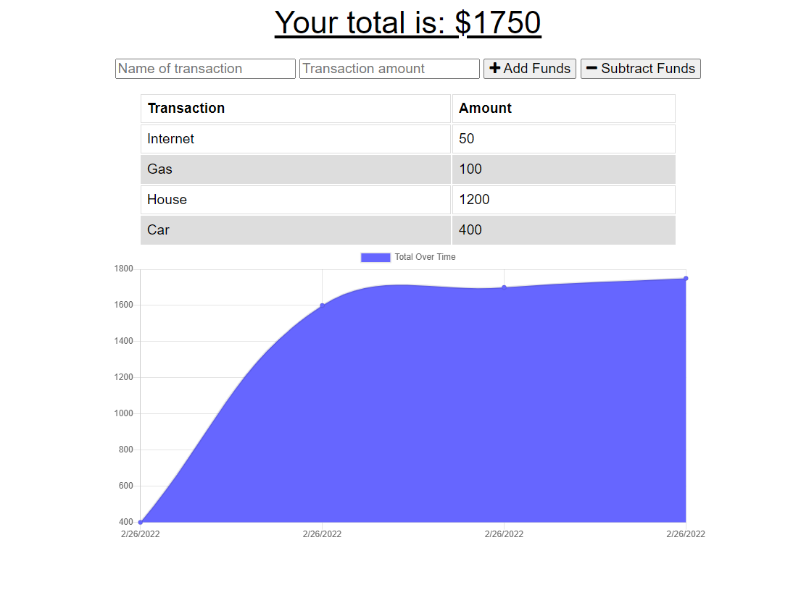

# Budget Tracker

  ## Licensing:
  

  ## Table of Contents
  - [Description](#description)
  - [Installation](#installation)
  - [Usage](#usage)
  - [Contribution](#contribution)
  - [Testing](#testing)
  - [Additional Info](#additional-info)

  ## Description:
  This project is an application that allows users to add expenses and deposits to their budget with or without a internet connection. If the user enters transactions offline, the changes will be reflected when they're brought back online. This application uses IndexDB, Service Workers, and Web Manifest for offline functionality and is deployed on Heroku.

  ## Installation:
  To install this project, clone the repository from GitHub and install all the dependencies listed in the package.json file. Afterwards run the server by typing 'npm start'.

  ## Usage:
  This application will allow users to create new transactions whether it's a deposit or withdraw, with or without internet connection. Please view application on [Heroku](https://mighty-wave-89856.herokuapp.com/) 

  ## License:
  MIT

  ## Contribution:
  Wyatt C.

  ## Testing:
  There are no tests for this application.

  ## Additional Info:
  - Github: [wcastellan](https://github.com/wcastellan)
  - Email: wcastellan@yahoo.com 